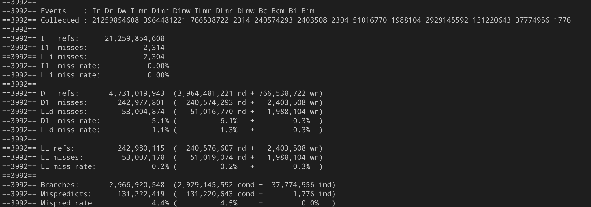
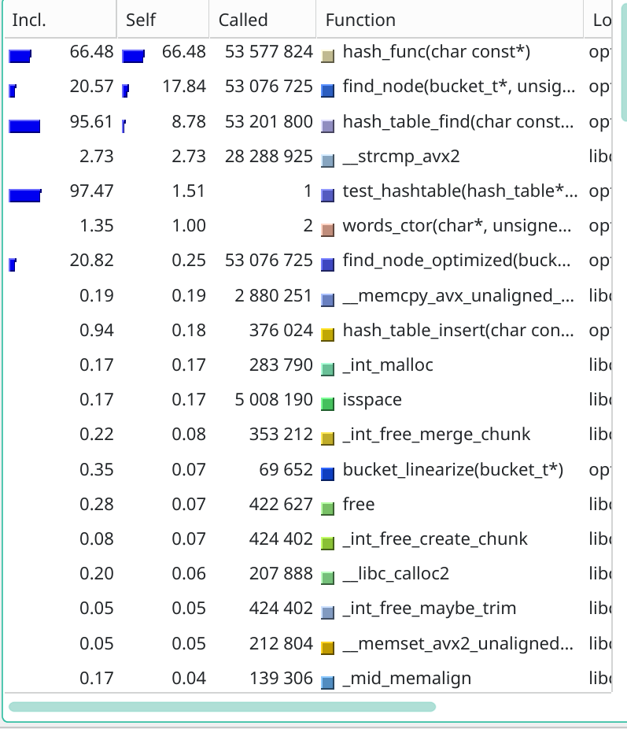
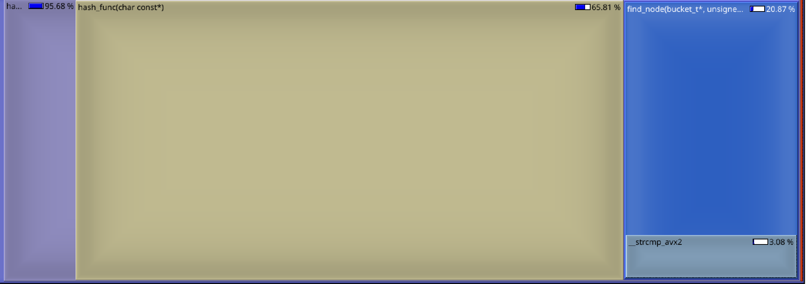
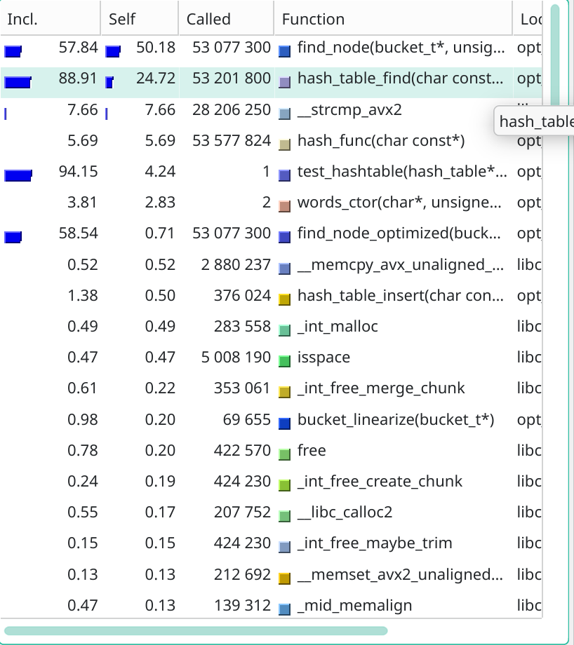
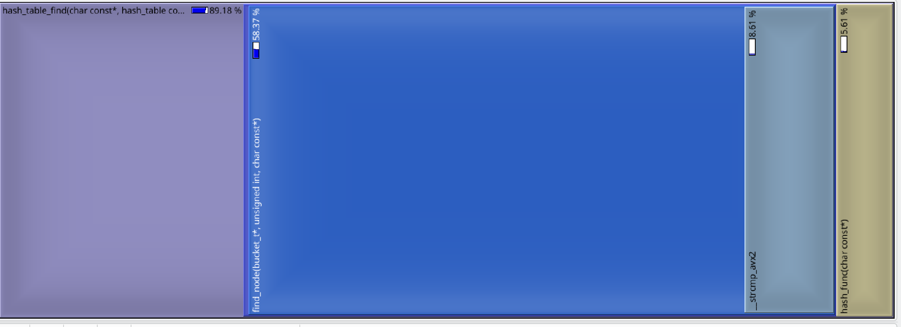
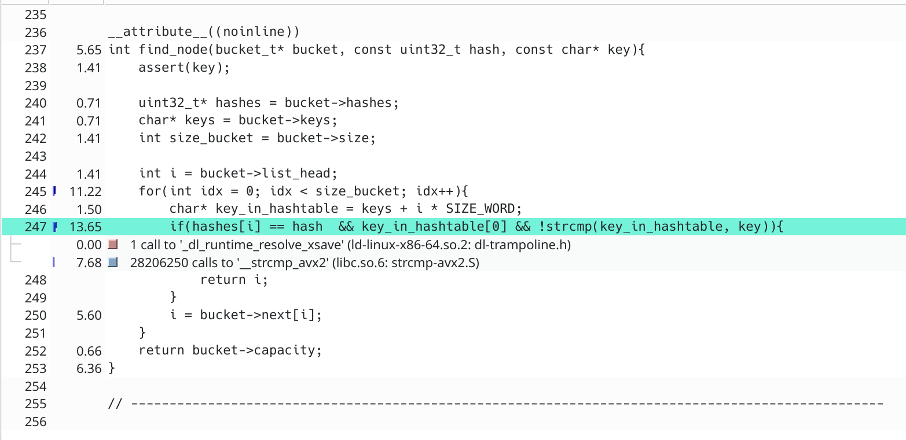
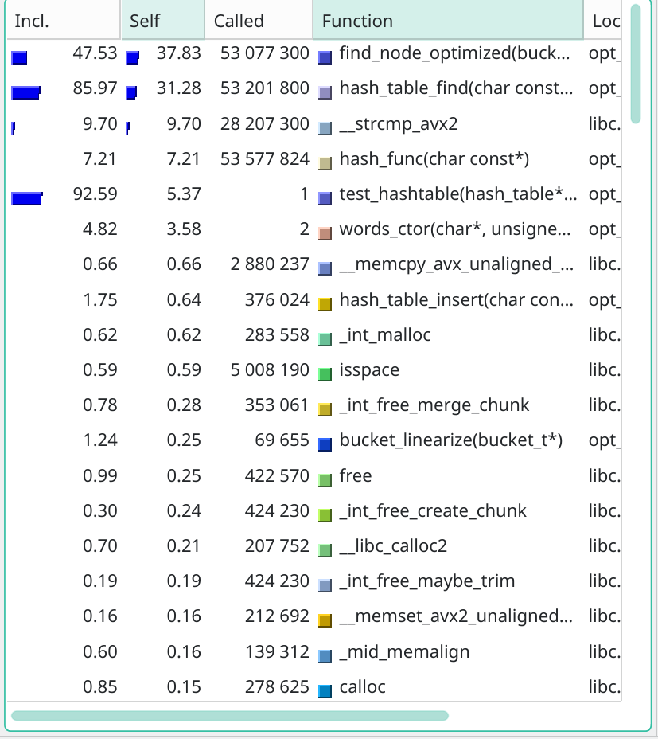
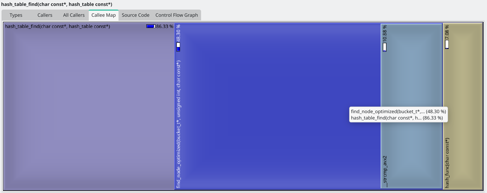
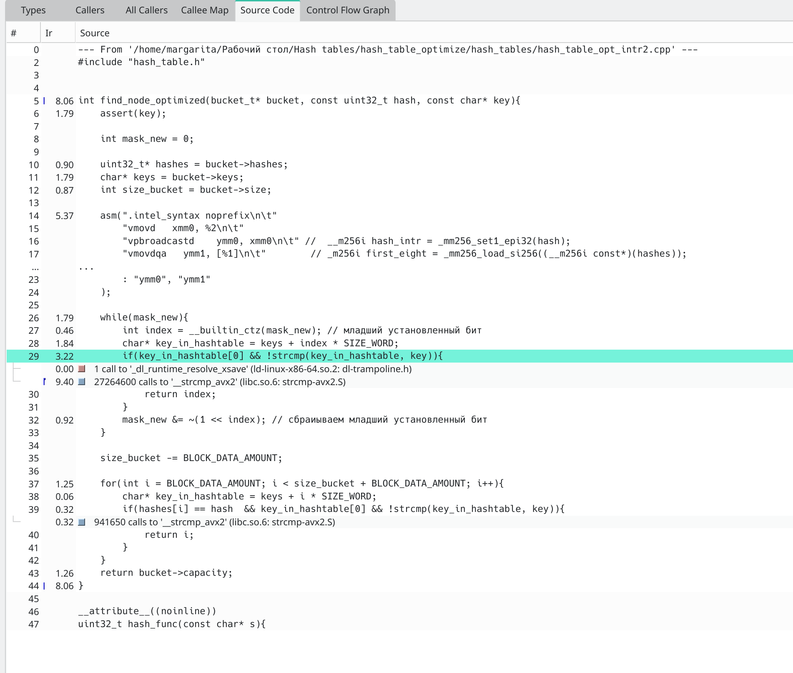

# Исследование ассемблерных оптимизаций на примере хэш-таблиц

В данной работе мы будем различным образом оптимизировать время поиска элемента в [хэш-таблице с закрытой адресацией и решением коллизий методом цепочек](https://neerc.ifmo.ru/wiki/index.php?title=%D0%A0%D0%B0%D0%B7%D1%80%D0%B5%D1%88%D0%B5%D0%BD%D0%B8%D0%B5_%D0%BA%D0%BE%D0%BB%D0%BB%D0%B8%D0%B7%D0%B8%D0%B9). При такой адресации каждый элемент таблицы в зависимости от реализации может хранить либо указатель на начало списка ключей, либо сам список.

Метод цепочек применяется для обработки коллизий — ситуаций, когда разные ключи после применения хэш-функции попадают в одну и ту же ячейку таблицы. В этом случае элементы не заменяют друг друга, а сохраняются в отдельной цепочке, связанной с данной ячейкой.

При добавлении нового элемента сначала вычисляется значение хэш-функции, определяющее индекс в таблице. Если соответствующая ячейка пуста, элемент помещается туда. Если же в этой ячейке уже есть элементы, новый ключ добавляется в цепочку. При поиске элемента алгоритм сначала находит нужную ячейку по хэш-функции, а затем последовательно просматривает элементы цепочки, сравнивая сначала хэш элемента, а в случае совпадения хэша - сам элемент.

Если размер таблицы равен составному числу, некоторые ключи могут чаще попадать в одни и те же ячейки из-за общих делителей. При простом размере таблицы такая проблема возникает реже, поэтому в текущей работе будем выбирать в размер хэш-таблицы, равный простому числу. 

Эффективность работы хэш-таблицы зависит от качества хэш-функции то есть от того, насколько равномерно ключи распределяются по ячейкам таблицы.

## Выбор хэш-функции

Для выбора хэш-функции использовалась хэш-таблица, каждый элемент которой хранит указатель на начало односвязного списка ключей. При возникновении коллизии новый ключ добавляется в начало соответствующего списка. Размер таблицы фиксирован и равен примерно 5000 бакетам, рехэширование не выполняется.

Были рассмотрены следующие хэш-функции:

- длина слова;
- первая буква слова;
- сумма ASCII-кодов символов в слове;
- полиномиальный хэш;
- CRC32;
- Jenkins one-at-a-time 32;
- ELF;
- FNV-1a;
- MurmurHash3.

Для сравнения качества хэш-функций использовался критерий согласия хи-квадрат Пирсона. Нулевая гипотеза состояла в том, что хэш-функция распределяет ключи по бакетам равномерно. Чем больше значение `p-value`, тем меньше оснований отвергать эту гипотезу, следовательно тем лучше наблюдаемое распределение согласуется с равномерным. Также была посчитана дисперсия количества элементов в одном бакете.

Тестирование проводилось на наборе слов `output.txt`, содержащем около 20000 уникальных слов, которые были взяты из английского перевода романа А. С. Пушкина «Евгений Онегин» и произведений Шекспира. Мне кажется, такой набор данных можно считать достаточно близким к данным, с которыми может быть использована хэш-таблица.

| Хэш-функция | Дисперсия количества элементов | p-value |
|--------|------|------|
| hash_length     | 11094.51  | 0.0 |
| hash_first_letter      | 3248.38   | 0.0 |
| hash_sum_letters      | 131.95 | 0.0 |
| hash_polynomial      | 4.11  | 0.77 |
| hash_crc32     | 4.17 | 0.52 |
| hash_jenkins_one_at_a_time32      | 4.21 | 0.31 |
| elf_hash     | 4.18 | 0.46 |
| fnv1a_hash      | 4.13 | 0.70 |
| murmur3_hash      | 4.16 | 0.56 |

Для хэш-функций: длина строки, первая буква в слове, сумма ASCII-кодов символов в слове нулевая гипотеза отвергается. Это означает, что данные функции распределяют ключи по бакетам неравномерно.

Для остальных хэш-функций у нас нет оснований отвергать нулевую гипотезу. Наибольший p-value получил полиноминальный хэш, поэтому его распределение на данной выборке лучше всего согласуется с равномерным. Также данный хэш показал наименьшую дисперсию числа элементов в бакете. Поэтому, в дальнейшей работе будет использоваться именно эта хэш-функция.

## Оптимизация хэш-таблиц

В рамках данной части работы мы рассмотрим 3 оптимизации: замена части кода на SIMD варианты, ассемблерная вставка, функция на ассемблере, написанная в отдельном файле.

Поскольку хэш-таблица уже является достаточно эффективной с алгоритмической точки зрения структурой данных, а целью работы было продемонстрировать различные оптимизации, было принято решение использовать повышенное значение load factor, равное 10. Также в реализации была добавлена возможность рехэширования, чтобы структура данных сохраняла работоспособность при увеличении количества элементов. В экспериментах размер таблицы подбирался так, чтобы рехэширование не требовалось.

### Немного про структуру хэш-таблиц

#### Замена хэш-таблицы на более cache-friendly

Когда я только начинала делать эту работу, я решила оставить для этой части хэш-таблицу, написанную ранее. В этой реализации каждый бакет хранил указатель на начало односвязного списка, а поиск элемента в цепочке выполнялся следующим обрвзом:

```c
static node_t* find_node(node_t* node, const uint32_t hash, const char* key){
    assert(key);

    while(node){
        if(node->hash == hash && !strcmp(node->key, key)){
            return node;
        }
        node = node->next;
    }

    return node;
}
```

Однако при написании оптимизаций стало понятно, что такую реализацию хэш-таблицы сложно оптимизировать. В строке:

```c
node = node->next;
```

Происходит переход по указателю на следующий элемент списка, но элементы могут находиться в памяти в произвольных местах. Поэтому процессор не может эффективно использовать пространственную локальность: данные хуже попадают в кэш, а каждый следующий шаг зависит от загрузки очередного указателя. Из-за этого такую функцию сложно оптимизировать, например нельзя просто сравнивать сразу 8 хэшей за одну итерацию цикла, потому что эти хэши лежат в разных узлах списка, адреса которых заранее неизвестны.


Поэтому было принято решение изменить реализацию хэш-таблицы так, чтобы данные внутри одного бакета хранились не в отдельных узлах односвязного списка, а в нескольких массивах, а связи между элементами задавались не указателями, а индексами в массивах `next` и `prev`. Также односвязный список был заменен двусвязным циклическим списком.

```c
struct bucket_t{
    char* keys;
    uint32_t* hashes;
    int* next;
    int* prev;
    int list_head;
    bool is_linearized;
    int capacity;
    int first_free;
    int size;
};
```

#### Немного про длину ключа в хэш-таблице

Хэш-таблица хранит ключи так, что под каждую строку выделяется 32 байта, так как в тестовом наборе максимальная длина слова равна 32 символам(с учетом \0), а более длинные слова встречаются редко. Если строка короче 32 символов, оставшаяся часть заполняется нулевыми байтами. Такой формат упрощает дальнейшие оптимизации хэш таблиц.

#### Немного про линеаризацию

Также у каждого бакета есть флаг `is_linearized`, если он равен true, то применяются оптимзированные версии функции `find_node`. После вставки или удаления элемента он сбрасывается в false, потому что данные внутри бакета могли перестать быть удобными для оптимизированного поиска.

В рамках линеаризации бакета массивы `keys` и `hashes` выравниваются по 32-байтной границе, а элементы размещаются рядом в памяти. Если в бакете меньше 8 элементов, размер массивов всё равно становится равным 8, так как это нужно для одной из оптимизаций.

Перед проведением тестов все бакеты линеаризуются.

### Методика тестирования

Размер хэш-таблицы составляет 70001 бакет. Таблица строится на основе набора данных `words_alpha.txt`, содержащего около 370000 английских слов.
Для тестирования используется набор слов из файла `words.txt`, содержащий около 2000000 английских слов. Из них примерно 1000000 слов взяты из файла `words_alpha.txt`,а ещё 1000000 слов сгенерированы как случайные последовательности букв.

Для измерения времени выполнения используется функция `clock_gettime` с таймером `CLOCK_MONOTONIC_RAW`.

Данная функция возвращает время, считываемое напрямую с аппаратного таймера и не подверженное корректировкам со стороны операционной системы. В частности, это исключает влияние любых механизмов коррекции времени со стороны ОС: как скачкообразных (`NTP`), так и плавных (`adjtime`), а также внутренних поправок ядра, применяемых к `CLOCK_MONOTONIC`.

Используется следующая схема замеров:

- В одном тесте таймер запускается перед началом поиска всех слов из тестового набора данных и останавливается после её завершения. Это позволяет снизить влияние погрешности, возникающей при измерении времени с помощью `clock_gettime`
- Каждая реализация тестируется 1050 раз:
  - первые 50 запусков считаются разогревочными: они нужны для прогрева кэшей и стабилизации частоты процессора, поэтому их результаты не сохраняются для дальнейшего анализа;
  - оставшиеся 1000 запусков используются при обработке результатов.
- Для каждой реализации проводится 2 независимых серии измерений.

Код компилируется g++ с флагами:

```
-О3 -march=native -Wall -Wextra
```

Эксперименты проводились на процессоре `Intel Core Ultra 9 285H`, операционная система `Linux 6.18.18-1-MANJARO`

Выполнение закреплялось за конкретным ядром `taskset -c 3 ./program` и ядро изолировалось от планировщика ОС `GRUB_CMDLINE_LINUX_DEFAULT="isolcpus=3"`

Также в процессе замеров контролировалось, что тактовая частота процессора фиксирована и отсутствует тротлинг, для этого был написан скрипт `control.sh`, который запускался параллельно с тестируемой программой. Скрипт сохранял данные в файл `control.csv`: название запущенной программы, текущую тактовую частоту процессора в килогерцах, температуру в миллиградусах и время замера.

Для доказательства того, что частота и температура изменялись слабо в процессе тестирования, посчитаем коэффицент вариации для всех замеров.

| Тест | CV частоты, % | CV температуры, % |
|-----|-----|-----|
| 1 | 1.61 | 2.47 |
| 2 | 4.27 | 2.31 |
| 3 | 2.80 | 1.80 |
| 4 | 2.49 | 2.29 |
| 5 | 3.66 | 2.80 |

По значениям коэффициента вариации видно, что во время замеров тактовая частота и температура оставались достаточно стабильными. 

### Первая оптимизация

Сначала найдем ассимптотический доверительный интервал времени работы хэш-таблицы без дополнительных оптимизаций: 0.4127 (± 0.0003) секунд

Посмотрим, в каких частях программы тратится больше всего времени. Для этого использовался профилировщик:

```bash
valgrind --tool=callgrind --cache-sim=yes
```

Сначала рассмотрим промахи кэша:



Хэш-таблица получилась достаточно cache-friendly, так как количество промахов кэша невелико, поэтому отдельно оптимизировать работу с кэшем не имеет смысла.

Далее посмотрим, какие функции занимают наибольшую долю времени работы программы:






Из результатов профилирования видим, что значительная часть времени тратится на расчет хэша. Поэтому первой оптимизацией будет ускорение хэш функции. Изначально в качестве основной хэш-функции был выбран полиномиальный хэш, так как он хорошо распределял ключи по бакетам, но его довольно-таки сложно ускорить, например реализовав подсчет сразу для нескольких символов, так как на каждой итерации значение хэша зависит от результата предыдущей итерации, поскольку текущий хэш умножается на основание p, а затем к нему прибавляется ASCII-код символа.

Поэтому с целью оптимизации была выбрана другая хэш-функция — CRC32, так как во-первых для нее существуют intrinsic-функции, позволяющие обрабатывать данные быстрее, во-вторых значение p-value по критерию согласия хи-квадрат Пирсона было достаточно высоким, а дисперсия распределения по бакетам оставалась достаточно хорошей. 

Итоговая версия хэш-функции:

```c
uint32_t hash_func(const char* s){
    assert(s);

    uint32_t crc = 0;

    crc = _mm_crc32_u64(crc, *((const uint64_t*)(s + 0)));
    crc = _mm_crc32_u64(crc, *((const uint64_t*)(s + 8)));
    crc = _mm_crc32_u64(crc, *((const uint64_t*)(s + 16)));
    crc = _mm_crc32_u64(crc, *((const uint64_t*)(s + 24)));

    return crc;

}
```

Ассимптотический доверительный интервал времени работы хэш-таблицы c заменой хэш функции: 0.2047 (± 0.0002) секунд

### Вторая оптимизация

Посмотрим, какие функции занимают наибольшую долю времени работы программы:







Видим, что основная часть времени выполнения приходится на функцию find_node
```c
int find_node(bucket_t* bucket, const uint32_t hash, const char* key)
```



Вероятно, это связано с тем, что при поиске приходится последовательно проходить по элементам цепочки: для каждого узла сначала сравнивается хэш, а при его совпадении дополнительно выполняется сравнение ключей. Для оптимизации этого напишем ассемблерную вставку, которая будет загружать сразу 8 хэшей из массива и сравнивать их с искомым хэшем, а далее в цикле мы сравним строки для тех ключей, где хэши совпали. Если в бакете больше 8 ключей, то остальные сравним старым способом:

```c
int find_node_optimized(bucket_t* bucket, const uint32_t hash, const char* key){
    assert(key);

    int mask_new = 0;

    uint32_t* hashes = bucket->hashes;
    char* keys = bucket->keys;
    int size_bucket = bucket->size;

    asm(".intel_syntax noprefix\n\t" 
        "vmovd   xmm0, %2\n\t"           
        "vpbroadcastd    ymm0, xmm0\n\t" //  __m256i hash_intr = _mm256_set1_epi32(hash);
        "vmovdqa   ymm1, [%1]\n\t"        // _m256i first_eight = _mm256_load_si256((__m256i const*)(hashes)); 
        "vpcmpeqd ymm0, ymm0, ymm1\n\t"  //  __m256i mask =  _mm256_cmpeq_epi32 (hash_intr, first_eight);
        "vmovmskps  %0, ymm0\n\t"        // int mask_new = _mm256_movemask_ps((__m256)mask);
        ".att_syntax prefix\n\t"
        :"=r"(mask_new)                    
        :"r"(hashes), "r"(hash)           
        : "ymm0", "ymm1"                     
    );  

    while(mask_new){
        int index = __builtin_ctz(mask_new); // младший установленный бит
        char* key_in_hashtable = keys + index * SIZE_WORD;
        if(key_in_hashtable[0] && !strcmp(key_in_hashtable, key)){
            return index;
        }
        mask_new &= ~(1 << index); 
    }

    size_bucket -= BLOCK_DATA_AMOUNT;

    for(int i = BLOCK_DATA_AMOUNT; i < size_bucket + BLOCK_DATA_AMOUNT; i++){
        char* key_in_hashtable = keys + i * SIZE_WORD;
        if(hashes[i] == hash  && key_in_hashtable[0] && !strcmp(key_in_hashtable, key)){
            return i;
        }
    }
    return bucket->capacity;
}
```

Ассимптотический доверительный интервал времени работы хэш-таблицы c использованием оптимизации в виде ассемберной вставки: 0.1265 (± 0.0002) секунд

### Третья оптимизация

Посмотрим, какие функции занимают наибольшую долю времени работы программы:









Видим, что основная часть времени выполнения по прежнему приходится на функцию find_node
```c
int find_node(bucket_t* bucket, const uint32_t hash, const char* key)
```

В данной функции достаточно часто вызывается strcmp. Эта функция работает сравнительно медленно, поскольку рассчитана на общий случай: строки могут иметь разную длину, сравнение должно также определить лексикографический порядок. В нашей задаче рассматривается более частный случай: все ключи имеют фиксированный размер 32 байта и полностью помещаются в один ymm-регистр. Поэтому можно сравнивать сразу весь 32-байтный блок и получать только нужный нам результат — совпадают строки или нет. Для этого напишем ассемблерную функцию my_strcmp:

```asm
my_strcmp:  xor eax, eax
            vmovdqa ymm2, [rdi]      
            vmovdqa ymm1, [rsi]          
            vpcmpeqb ymm0, ymm1, ymm2
            vpmovmskb eax, ymm0
            ret
```

Важно, что в случае совпадения строк она возвращает 0xFFFFFFFF

Ассимптотический доверительный интервал времени работы хэш-таблицы c использованием оптимизации в виде ассемберной функции: 0.1161 (± 0.0002) секунд

### Итоговое сравнение хэш таблиц

| Реализация | Ассимптотический доверительный интервал времени работы | Ускорение относительно версии без оптимизаций | Ускорение относительно предыдущей версии |
|---|---:|---:|---:|
| Без оптимизаций | 0.4127 (± 0.0003) | 1.00 | — |
| Оптимизация хэша | 0.2047 (± 0.0002) | 2.02 | 2.02 |
| Оптимизация `find_node` | 0.1265 (± 0.0002) | 3.26 | 1.62 |
| Замена `strcmp` | 0.1161 (± 0.0002) | 3.55 | 1.09 |

Из таблицы видим, что доверительные интервалы для разных оптимизпций практически не пересекаются. При этом разница между средними временами выполнения заметно больше ширины доверительных интервалов. Поэтому различия между реализациями можно считать статистически значимыми без проведения дополнительных тестов.

Последняя оптимизация дала уже небольшое относительное ускорение и хорошее абсолютное ускорение, следовательно стоит закончить оптимизировать хэш таблицы, так как дальнейшие оптимизации усложнят понимание кода, но не ускорят его

### Бонус. Pgo - Profile-Guided Optimization

Сначала собираем версию программы для создания профиля, используем для этого версию без оптимизаций. После этого запускаем её на 1050 тестах. Результаты этих запусков не фиксируются, так как наша цель - собрать профиль выполнения. Затем пересобираем программу уже с использованием полученного профиля. После этого запускаем её так же, как и предыдущие реализации, и фиксируем время работы.

Ассимптотический доверительный интервал времени работы хэш-таблицы c использованием профилирования: 0.4091 (± 0.0004) секунд.

Разница между средними временами выполнения версии с профилированием и ранее рассмотренных версий заметно больше ширины доверительных интервалов. Поэтому различия между реализациями можно считать статистически значимыми без проведения дополнительных тестов.

## Выводы

Довольно неожиданным оказался результат PGO: версия с профилированием оказалась немного быстрее первой реализации, но не смогла обогнать ручные оптимизации. Я связываю это с тем, что в версии без оптимизаций используется полиномиальный хэш, который сам по себе достаточно тяжело ускорить только средствами компилятора, и даже при наличии профиля выполнения программы компилятор не может полностью заменить неудачно выбранный алгоритм или хэш-функцию.
Поэтому выбор хэш-функции сильно влияет на производительность всей хэш-таблицы, следовательно важно не только полагаться на оптимизации компилятора и средства вида PGO, но и понимать особенности реализации программы, например в случае этой работы ручная замена и оптимизация хэш-функции дали больший прирост производительности, чем PGO.